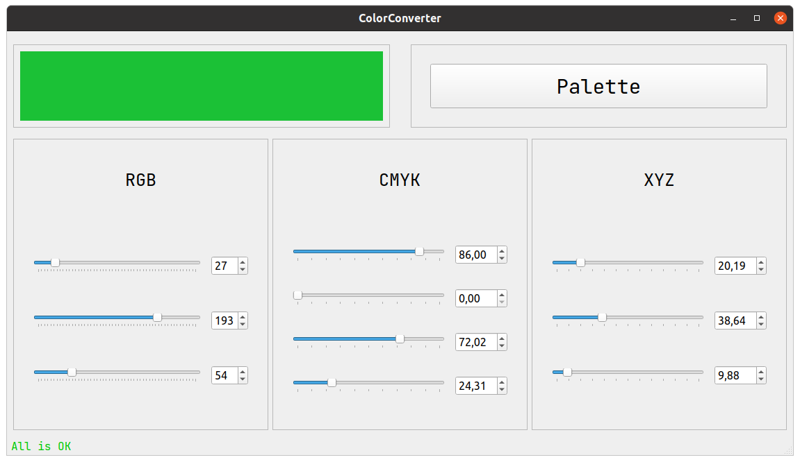
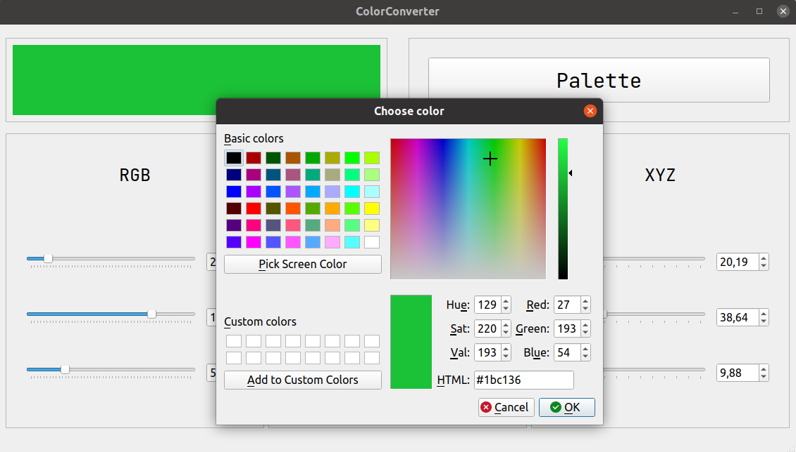

# Компьютерная графика. Лабораторная работа №1
> Солодуха Дмитри, 13 группа
## Задание
Создать приложение/веб-приложение, позволяющее пользователю выбирать, а затем интерактивно менять цвет, показывая при этом его составляющие в трех моделях одновременно. Цветовые модели: `CMYK`, `RGB`, `XYZ`.

## Реализация
Десктопное приложение было реализовано на языке `C++` с использованием фреймворка `Qt`. Полученное приложение можно видеть на скриншоте ниже:

Пользователь имеет возможность задавать цвета для каждой из цветовых моделей с помощью ползунков и полей для ввода. Также при нажатии на кнопку `Palette` появится цветовая палитра, которая позволяет выбрать необходимый цвет:

Выбранный цвет отображается в левой верхней панели. При округлениях пользователь может увидеть уведомляющее его об этом сообщение в статусной строке.

## Скачать и запустить
Архив со скомпилированным под `Windows x64` приложением и нужными библиотеками можно взять [тут](https://github.com/sMeDDveD/ComputerGraphicsLab1/releases/download/v1.0/Win64-deploy.zip).